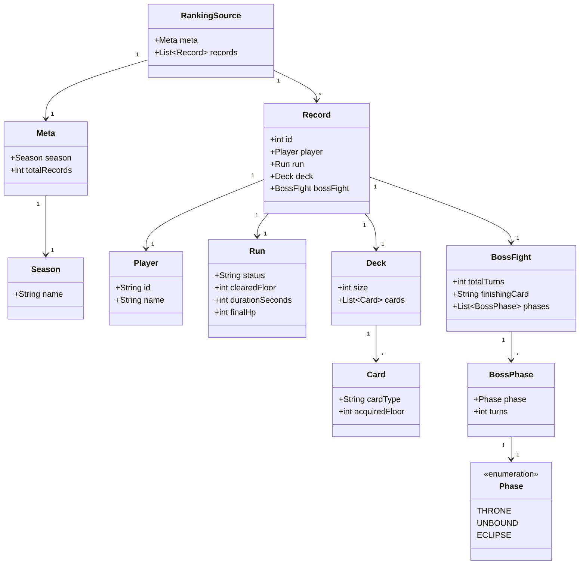

# 개인 프로젝트

## 1. 도커의 mysql 와 JPA 연결
도커 안의 터미널을 이용해 새 DB 를 생성하고 application.properties 로 연결

```properties
spring.datasource.url=jdbc:mysql://localhost:3306/mydb 
spring.datasource.username=root
spring.datasource.password=12345678
spring.datasource.driver-class-name=com.mysql.cj.jdbc.Driver

spring.jpa.hibernate.ddl-auto=update
#spring.jpa.properties.hibernate.dialect=org.hibernate.dialect.MySQLDialect
spring.jpa.show-sql=true 
```

## 2. DI (의존성) 주입

@Service 어노테이션이 없어 Controller에서 service 빈을 찾지 못하는 상태였다.
```JAVA
@Service //빠져있던 어노테이션
@RequiredArgsConstructor
public class GameService {

    private final GameRepository gameRepository;
    private final RunCardRepository runCardRepository;

    @Transactional(readOnly = true)
    public GameDetailResponse createGame(CreateRequest request) {
        Game game = gameRepository.save(new Game(request.getPlayerName()));
        saveDeck(game, request.getDeck());
        List<RunCard> cards = runCardRepository.findAllByGameOrderByIdAsc(game);
        List<CardResponse> deck = new ArrayList<>();
        for (RunCard card : cards) {
            deck.add(new CardResponse(card.getId(), card.getCardType(), card.getAcquiredFloor()));
        }
```

## 3. 게임 목록 조회
uri 가 클라이이언트가 보내는 GET /games 요청과 다른 /game 으로 되어 있어서
요청을 받지 못하는 상태였다.

```JAVA
@RestController
@RequiredArgsConstructor
public class GameController {
    private final GameService gameService;

    @GetMapping("/games") //game로 되어 있었다.
    public ResponseEntity<List<Object>> getGames() {
        // List<Object>는 임시 구현이며, Lv 7에서 제대로 고칩니다.
        // List.of()는 빈 목록을 돌려주는 임시 구현이며, Lv 7에서 제대로 고칩니다.
        return ResponseEntity.ok(List.of());
    }
```


## 4. Transactional 문제 
@Transactional 이 @Transactional(readOnly = true) 로 되어 있었다.
읽기 전용이면 새로 저장하는 것이 불가능하기에 500 상태 코드를 반환한 것이다.

```JAVA
@Service
@RequiredArgsConstructor
public class GameService {

    private final GameRepository gameRepository;
    private final RunCardRepository runCardRepository;

    @Transactional
    public GameDetailResponse createGame(CreateRequest request) {
        Game game = gameRepository.save(new Game(request.getPlayerName()));
        saveDeck(game, request.getDeck());
        List<RunCard> cards = runCardRepository.findAllByGameOrderByIdAsc(game);
        List<CardResponse> deck = new ArrayList<>();
        for (RunCard card : cards) {
            deck.add(new CardResponse(card.getId(), card.getCardType(), card.getAcquiredFloor()));
        }
        return new GameDetailResponse(
            game.getId(),
            game.getPlayerName(),
            game.getCurrentHp(),
            game.getCurrentFloor(),
            game.getPhase(),
            game.getStatus(),
            deck
        );
    }
```


## 5. Bean Validation: 게임 생성 

Entity 구조와 명세서 요청에 맞게 비어있던 응답 DTO를 만들었다.
Bean Validation 구조가 이미 완성되어 있는 요청DTO에 어노테이션을 붙이고 컨트롤러의 대응하는 메서드 패러미터@Valid 까지 확인

```
@Getter
public class CardResponse {
    // TODO (Lv 5): API 명세의 카드 응답 JSON에 맞게 필드를 만들고 생성자에서 채우세요.
    private final Long id;
    private final String cardType;
    private final int acquiredFloor;

    public CardResponse(Long id, String cardType, int acquiredFloor) {
        this.id = id;
        this.cardType = cardType;
        this.acquiredFloor = acquiredFloor;
    }
}

@Getter
public class RunCardRequest {
    // TODO (Lv 5): API 명세의 카드 필드 제약을 Bean Validation 어노테이션으로 붙이세요.
    @NotEmpty
    private String cardType;

    @Max(10)
    @Min(0)
    private Integer acquiredFloor;

    public RunCardRequest(String cardType, Integer acquiredFloor) {
        this.cardType = cardType;
        this.acquiredFloor = acquiredFloor;
    }
}


```

## 6.보상 카드 선택과 진행 저장
처음에는 이미 완성된 함정 문제인 줄 알았다. Service 쪽 메서드도 쭉 읽어보니 틀린 점이 없었고 
그래서 여쭤보니 ResponseEntity<>의 제네릭 부부의 ? (와일드카드) 가 우연히 문법에 맞아서 생긴 문제였다.
명세서에선 타입을 확실히 하라고 하였기에 타입을 일관성있게 바꾸어주었다.

```JAVA
//원본
   // TODO (Lv 6): 진행과 전체 덱 저장. 주석을 풀고 구현하세요.
    // @PutMapping("/games/{gameId}/progress")
    // public ResponseEntity<?> updateProgress(
    //     @PathVariable Long gameId,
    //     @Valid @RequestBody ProgressRequest request
    // ) {
    //     return ResponseEntity.ok(gameService.updateProgress(gameId, request));
    // }
//수정
//     TODO (Lv 6): 진행과 전체 덱 저장. 주석을 풀고 구현하세요.
     @PutMapping("/games/{gameId}/progress")
     public ResponseEntity<GameDetailResponse> updateProgress(
         @PathVariable Long gameId,
         @Valid @RequestBody ProgressRequest request
     ) {
         return ResponseEntity.ok(gameService.updateProgress(gameId, request));
     }


```

## 7. 저장된 여행 이어하기

서비스의 메서드 일부분을 모방하여 명세서를 보고 저장된 게임목록,게임 불러오기를 구현하였다.
7번은 다른 부분의 문제를 풀다 레포지토리쪽에 커스텀 메서드를 만드는 것을 보고 다시 수정하였다.


```JAVA
//컨트롤러 부분
 @GetMapping("/games")
    public ResponseEntity<List<GameSummaryResponse>> getGames() {

        return ResponseEntity.ok(gameService.getGames());
    }

    @GetMapping("/games/{gameId}")
    public ResponseEntity<GameDetailResponse> getGame(@PathVariable Long gameId){
        return ResponseEntity.ok(gameService.getGame(gameId));
    }

// TODO (Lv 7): 게임 목록 조회. 주석을 풀고 구현하세요.
    @Transactional(readOnly = true)
    public List<GameSummaryResponse> getGames() {
        List<Game> games = gameRepository.findAllByOrderByIdDesc(); //내림 차순으로 전부 가져옴

        return games.stream()
                .map(game -> new GameSummaryResponse(
                        game.getId(),
                        game.getPlayerName(),
                        game.getCurrentFloor(),
                        game.getCurrentHp(),
                        game.getPhase(),
                        game.getStatus()
                )).toList();
    }

//Service 부분

    // TODO (Lv 7): 게임 상세 조회. 주석을 풀고 구현하세요.
     @Transactional(readOnly = true)
     public GameDetailResponse getGame(Long gameId) {
        Game game =  findGame(gameId);
        List<RunCard> cards =  runCardRepository.findAllByGameOrderByIdAsc(game);

        List<CardResponse> responses = cards.stream()
                .map(card -> new CardResponse(
                        card.getId(),
                        card.getCardType(),
                        card.getAcquiredFloor()
                        )
                ).toList();

        return new GameDetailResponse(
                game.getId(),
                game.getPlayerName(),
                game.getCurrentHp(),
                game.getCurrentFloor(),
                game.getPhase(),
                game.getStatus(),
                responses
        );
     }

//레포지토리에 커스텀 메서드

    public List<Game> findAllByOrderByIdDesc();

//목록응답dto
@Getter
public class GameSummaryResponse {

    private final Long id;
    private final String playerName;
    private final int currentFloor;
    private final int currentHp;
    private final GamePhase phase;
    private final GameStatus status;

    public GameSummaryResponse(
            Long id,
            String playerName,
            int currentFloor,
            int currentHp,
            GamePhase phase,
            GameStatus status) {
        this.id = id;
        this.playerName = playerName;
        this.currentFloor = currentFloor;
        this.currentHp = currentHp;
        this.phase = phase;
        this.status = status;
    }
}

```

## 8. 더티 체킹: 이름 수정, 자식부터 삭제 
api 명세서 대로 업데이트와 , 삭제를 구현하였다. 
서비스의 @Valid 를 적긴하였는데 일단 컨트롤러 부분에서 한번 걸러낸 것을 추가로 걸러낼 필요가 있었을까 지금와서 생각해본다.


```JAVA
//컨트롤러 부분
 @PatchMapping("/games/{gameId}")
    public ResponseEntity<Void> renameGame(
            @PathVariable Long gameId,
            @Valid @RequestBody RenameRequest request
    ){
        gameService.renameGame(gameId,request);
        return ResponseEntity.noContent().build();
    }


    @DeleteMapping("/games/{gameId}")
    public ResponseEntity<Void> deleteGame(@PathVariable Long gameId){
        gameService.deleteGame(gameId);
        return ResponseEntity.noContent().build();
    }


//서비스 부분

   // TODO (Lv 8): 플레이어 이름 변경 — 변경 감지로 수정
     @Transactional
    public void renameGame(Long gameId, @Valid RenameRequest request) {
        Game game = findGame(gameId);
        game.rename(request.getPlayerName());
    }

    // TODO (Lv 8): 게임 삭제
    @Transactional
    public void deleteGame(Long gameId) {
        Game game = findGame(gameId);
        runCardRepository.deleteAllByGame(game);
        gameRepository.deleteById(gameId);
    }


//이름 변경 요청에 사용되는dto
@Getter
public class RenameRequest {
    @Size(min = 2,max =12)
    private String playerName;

    public RenameRequest(String playerName) {
        this.playerName = playerName;
    }
}
```

## 9. Lv 9. 끝난 게임 덮어쓰기 막기 
9번은 이미 게임오버된 상황의 경우 게임 재진입이 불가하지만 
post맨 등으로 직접적인 url 호출을 할 경우 덮어씌워지는 상황이 나왔다.
만일 game 의 status 가 playing 상태가 아니라면 false 를 반환하는 메서드로 예외처리를 진행하였다.


```JAVA
@Transactional
    public GameDetailResponse updateProgress(Long gameId, ProgressRequest request) {
        Game game = findGame(gameId);

        if (game.isFinished()) {
            //만약 플레이중이 아닐 경우 오류 409
            throw new ResponseStatusException(HttpStatus.CONFLICT);
        }
```


## 10.  전역 예외 처리: 404·409에 message 붙이기 
이전에 400과 409 상태코드로 던진 예외를 전역적 예외처리로 통합하여 관리한다.
예제 아래 예외 코드들은 상태메세지를 표시하지 않아서 오류가 생겼을 때 관리가 힘든 것을 알았다


```
//GlobalExceptionHandler 에 전역적 예외추가
// TODO (Lv 10): GameNotFoundException(404)과 GameFinishedException(409)을 처리하는 핸들러를 추가하세요.
    @ExceptionHandler(GameNotFoundException.class)
    public ResponseEntity<ErrorResponse> handleGameNotFoundValidation(
        GameNotFoundException e, HttpServletRequest request){
        String detailMessage = e.getMessage();

        return respond(HttpStatus.NOT_FOUND,detailMessage,request);
    }

    @ExceptionHandler(GameFinishedException.class)
    public ResponseEntity<ErrorResponse> handleGameFinishedValidation(
            GameFinishedException e , HttpServletRequest request){
        String detailMessage = e.getMessage();

        return  respond(HttpStatus.CONFLICT,detailMessage,request);
    }

```

## 11.N+1 없는 카드 수 집계와 저장 시간
생성, 수정 시간을 알기 위해 JPA Auditing 기능을 사용하였다. 어플리케이션엔 @EnableJpaAuditing 를 붙였고
ReponseDto 나 service 에도 두 개의 시간을 받도록 바꾸었다.

N+1 문제를 생각하면서 (리스트와 같은 자료구조안의 데이터를 전부 조회하면 1회가 아닌 N번만큼 조회는 문제)
Join을 해서 조회를 해야하는 이유를 알았다.
SQL 과 JPQL 은 맥락은 비슷한데 문법이 조금 다른 부분이 있었다.
From Runcard r join r.game 처럼 객체 관계를 이용한 조인 방법이 첫번째
where g in :games 라는 문법으로  @Param("games") List<Game> games의 데이터를 가져오는 방식이 두번째
select new com.gamebasic.runcard.dto.projection.DeckCount(g.id,count(r)) 처럼 dto에 조회 결과를 담는 방식이 세번째이다.


```
//상속시킬 엔티티 클래스
@Getter
@MappedSuperclass
@EntityListeners(AuditingEntityListener.class)
public abstract class BaseEntity {

    @Column(updatable = false)
    @CreatedDate
    private LocalDateTime createdAt;

    @LastModifiedDate
    private LocalDateTime updatedAt;

}

//상속받은 자식 클래스
@Getter
@Entity
@Table(name = "games")
@NoArgsConstructor(access = AccessLevel.PROTECTED)
public class Game extends BaseEntity{
    @Id
    @GeneratedValue(strategy = GenerationType.IDENTITY)
    private Long id;

@Transactional
    public GameDetailResponse createGame(CreateRequest request) {
        Game game = gameRepository.save(new Game(request.getPlayerName()));
        saveDeck(game, request.getDeck());
        List<RunCard> cards = runCardRepository.findAllByGameOrderByIdAsc(game);
        List<CardResponse> deck = new ArrayList<>();
        for (RunCard card : cards) {
            deck.add(new CardResponse(card.getId(), card.getCardType(), card.getAcquiredFloor()));
        }
        return new GameDetailResponse(
                game.getId(),
                game.getPlayerName(),
                game.getCurrentHp(),
                game.getCurrentFloor(),
                game.getPhase(),
                game.getStatus(),
                deck,
                game.getCreatedAt(),
                game.getUpdatedAt()
        );
    }

//dto projection 용 메서드
package com.gamebasic.runcard.dto.projection;

import lombok.Getter;

@Getter
public class DeckCount {
    private final Long gameId;
    private final Long deckSize;

    public DeckCount(Long gameId, Long deckSize) {
        this.gameId = gameId;
        this.deckSize = deckSize;
    }
}


//RunRepository 안에 dto 프로젝션 쿼리 메서드 생성

   // TODO (Lv 11): @Query 작성
    @Query("select new com.gamebasic.runcard.dto.projection.DeckCount(g.id,count(r))" +
            "from RunCard r join r.game g where g in :games" +
            " group by g.id")
     List<DeckCount> countByGames(@Param("games") List<Game> games);
}


```


## 12. 랭킹
RestClient 로 외부 api에 요청을 해서 데이터를 가져온다.
사용방식은 다음과 같았다.
클라이언트 필드를 new 를 통해 초기화하고
.get()  //POST,GET 등 보낼 HTTP 요청의 종류
.uri()  //uri 입력칸
.retrieve()  //앞선 과정으로 진짜 요청 보내기
.body()  //요청하여 받은 응답을 객체로 파싱하여 저장

JSON의 구조와 같게 객체 클래스들을 만들었다.
이때 클래스타입의 이름은 중요하지 않고 필드 이름은 구조안의 데이터 이름과 통일해야한다.
배열은 List로 하는 게 제일 보편적인듯하다.

필터링과 정렬 조건은 한 메서드에 몰아 쓰려니 메서드가 너무 비대해져서
Predicate  , Comparator 라는 각각 스트림의 filter() , sorted() 에 대응하는 메서드를 만들어서 관리했다.

RankingResponse 에 필터링한 내용들을 바탕으로 대입해줘서 응답을 보냈다.



```JAVA
 //필터링 타입인 Predicate 를 모아둠
    //run.durationSeconds가 층당 30초 이상, 즉 run.clearedFloor × 30 이상
    Predicate<Record> clearTimeOk = r -> r.getRun().getDurationSeconds() >= r.getRun().getClearedFloor() * 30;
    //run.finalHp가 1 이상 99 이하
    Predicate<Record> hpOk = r -> r.getRun().getFinalHp() >= 1 && r.getRun().getFinalHp() <= 99;
    //deck.cards가 9장 이상 20장 이하이고, deck.size가 deck.cards의 실제 개수와 같음
    Predicate<Record> deckCardsOk = r -> r.getDeck().getCards().size() >= 9 && r.getDeck().getCards().size() <= 20 && r.getDeck().getSize() == r.getDeck().getCards().size();
    //카드가 enum 목록안에 존재하는 카드인지를 확인
    Predicate<Record> cardTypeOk = r -> r.getDeck().getCards().stream().allMatch(card -> Arrays.stream(CardType.values()).anyMatch(cardType -> cardType.name().equals(card.getCardType())));
    //카드를 휙득한 층이 0이상 9이하인지
    Predicate<Record> acquiredFloorOk = r -> r.getDeck().getCards().stream().allMatch(card -> card.getAcquiredFloor() >=0 && card.getAcquiredFloor() <=9);
    //보스 페이즈가 순서대로 THRONE,UNBOUND,ECLIPSE 순서인지 와 각 turns 가 1이상이고  totalTurns 가 세 개의 turns 의 합과 같은지
    Predicate<Record> bossPhaseOk = r-> r.getBossFight().getPhases().stream().map(BossPhase::getPhase).toList().equals(List.of(Phase.THRONE,Phase.UNBOUND,Phase.ECLIPSE))
            && r.getBossFight().getPhases().stream().allMatch(p -> p.getTurns() >=1) && r.getBossFight().getTotalTurns() == r.getBossFight().getPhases().stream().mapToInt(BossPhase::getTurns).sum();
    //bossFight.finishingCard가 그 기록의 deck.cards에 있는 카드 타입
    Predicate<Record> finishingCardOk = r-> r.getDeck().getCards().stream().anyMatch(card -> Objects.equals(card.getCardType(), r.getBossFight().getFinishingCard()));
    //종합적인 제외 조건
    Predicate<Record> totalPredicate = clearTimeOk.and(hpOk).and(deckCardsOk).and(cardTypeOk).and(acquiredFloorOk).and(bossPhaseOk).and(finishingCardOk);

    //정렬 타입인 Comparator를 모아둠
    //우선 run.durationSeconds 으로 오름차순
    Comparator<Record> orderByDurationSecondsAsc= Comparator.comparingInt(record -> record.getRun().getDurationSeconds());
    // run.finalHp 을 기준으로 내림차순 reversed 사용 시 Object 로 형변환이 되려 에러 발생 (Record record) 처럼 명시해줘야한다.
    Comparator<Record> orderByFinalHpDesc = Comparator.comparingInt((Record record) -> record.getRun().getFinalHp()).reversed();
    // id를 기준으로 오름차순
    Comparator<Record> orderByIdAsc = Comparator.comparingInt(Record::getId);

    //종합적인 정렬 조건 (thenComparing 은 이전 조건에서 동일하여 정렬되지 못한 개체를 정렬)
    Comparator<Record> totalOrder = orderByDurationSecondsAsc.thenComparing(orderByFinalHpDesc).thenComparing(orderByIdAsc);
```
